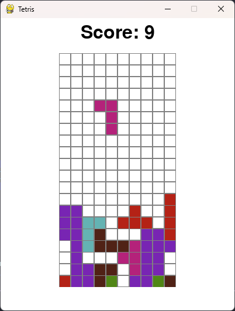

# Tetris Game

Este projeto é uma implementação simples do clássico jogo **Tetris**, desenvolvido utilizando a biblioteca [Pygame](https://www.pygame.org/).

## 🕹️ Sobre o Jogo

No jogo, as peças de Tetris caem do topo da tela, e o jogador deve movê-las e girá-las para formar linhas completas. Quando uma linha é formada, ela desaparece e as peças acima caem uma linha, enquanto a pontuação aumenta.

### Características
- **Peças de Tetris**: Peças clássicas que caem do topo da tela.
- **Linhas Completas**: Linhas formadas são removidas, fazendo as peças acima caírem.
- **Pontuação**: A pontuação aumenta à medida que as linhas são removidas.

## 📷 Imagens do Jogo

### Jogo em Ação


## 🛠️ Como Executar o Jogo

1. Certifique-se de ter o [Python](https://www.python.org/downloads/) e o [Pygame](https://www.pygame.org/wiki/GettingStarted) instalados.
2. Clone este repositório:
   ```bash
   git clone https://github.com/gustakakkoii/tetris.git
   ```
3. Acesse o diretório do projeto:
   ```bash
   cd tetris-game
   ```
4. Execute o jogo:
   ```bash
   python main.py
   ```

## 📚 Requisitos

- **Python 3.6+**
- **Pygame 2.0+**

Instale as dependências com:
```bash
pip install pygame
```

## 🎮 Como Jogar

- Use as **setas do teclado** para mover as peças de Tetris.
- Complete uma linha para removê-la e ganhar pontos.
- O jogo continua até que as peças atinjam o topo da tela.

## Contribuições

Contribuições são bem-vindas! Sinta-se à vontade para abrir issues ou enviar pull requests com melhorias ou novas funcionalidades.

---

Desenvolvido por [Gustavo Almeida](https://github.com/gustakakkoii)
